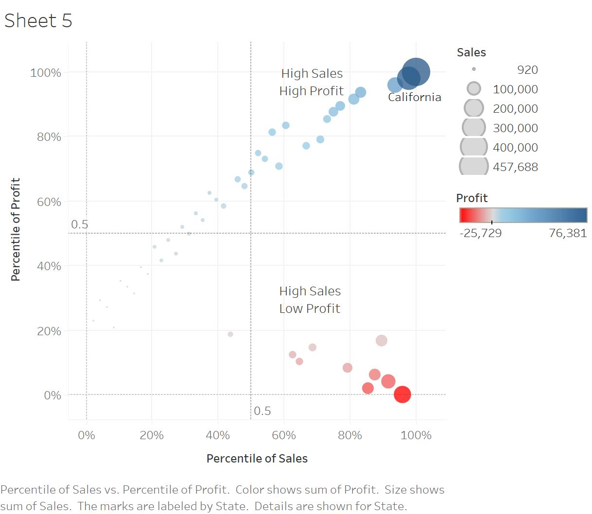

```{r setup, include=FALSE}
knitr::opts_chunk$set(echo = FALSE)
```

# 1.0 Overview

In this article, we will show you how to plot a figure with multiple histograms by using [**ggplot2**](https://ggplot2.tidyverse.org/) and **ggpubr** packages. 


# 2.0 Installing and Launching R Packages

Before you get started, you are required:

* to start a new R project, and
    * to create a new R Markdown document.

Figure below shows the quadrant plot of tableau.



Next, you will use the code chunk below to install and launch ggpubr and tidyverse in RStudio.

# R code 
packages = c('ggpubr', 'tidyverse')

for(p in packages){library
  if(!require(p, character.only = T)){
    install.packages(p)
  }
  library(p, character.only = T)
}


# 3.0 Importing and Preparing The Data Set 

In this hands-on exercise, the [Wine Quality Data Set](https://archive.ics.uci.edu/ml/datasets/wine+quality) of UCI Machine Learning Repository will be used.  The data set consists of 13 variables and 6497 observations.  For the purpose of this exercise, we have combined the red wine and white wine data into one data file.  It is called wine_quality and is in csv file format.  


## 3.1 Importing Data

First, let us import the data into R by using read_csv() of readr package.  


# R code
wine <- read_csv("data/wine_quality.csv")


Notice that beside quality and type, the rest of the variables are numerical and continuous data type. 


# 4.0 Univariate EDA with Histogram

In the figure below, multiple histograms are plottted by using ggplot() and geom_histogram() of ggplot2 package.  Then, ggarrange() of ggpubr package is used to patch these histogram into a single figure to reveal the distribution of the selected variables in the wine quality data sets.  

# Rcode
fa <- ggplot(data=wine, aes(x= `fixed acidity`)) +
  geom_histogram(bins=20, color="black", fill="light blue")
va <- ggplot(data=wine, aes(x= `volatile acidity`)) +
  geom_histogram(bins=20, color="black", fill="light blue")
ca <- ggplot(data=wine, aes(x= `citric acid`)) +
  geom_histogram(bins=20, color="black", fill="light blue")
rs <- ggplot(data=wine, aes(x= `residual sugar`)) +
  geom_histogram(bins=20, color="black", fill="light blue")
ch <- ggplot(data=wine, aes(x= `chlorides`)) +
  geom_histogram(bins=20, color="black", fill="light blue")
fSO2 <- ggplot(data=wine, aes(x= `free sulfur dioxide`)) +
  geom_histogram(bins=20, color="black", fill="light blue")
tSO2 <- ggplot(data=wine, aes(x= `total sulfur dioxide`)) +
  geom_histogram(bins=20, color="black", fill="light blue")
density <- ggplot(data=wine, aes(x= density)) +
  geom_histogram(bins=20, color="black", fill="light blue")
pH <- ggplot(data=wine, aes(x= pH)) +
  geom_histogram(bins=20, color="black", fill="light blue")
sulphates <- ggplot(data=wine, aes(x= sulphates)) +
  geom_histogram(bins=20, color="black", fill="light blue")
alcohol <- ggplot(data=wine, aes(x= alcohol)) +
  geom_histogram(bins=20, color="black", fill="light blue")

ggarrange(fa, va, ca, rs, ch, fSO2, tSO2, density, pH, sulphates, alcohol, 
          ncol = 4, nrow = 3)


